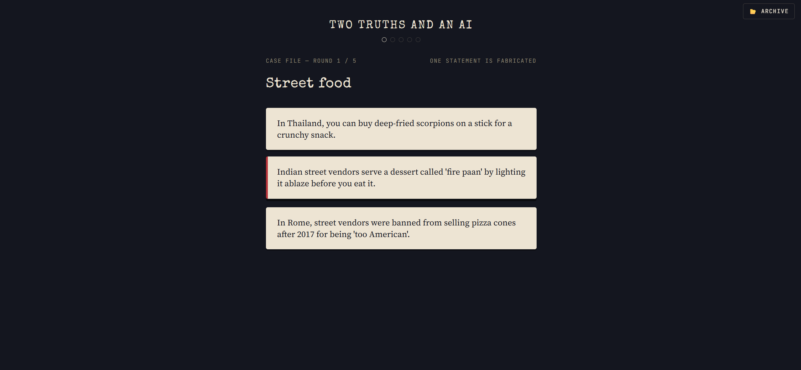
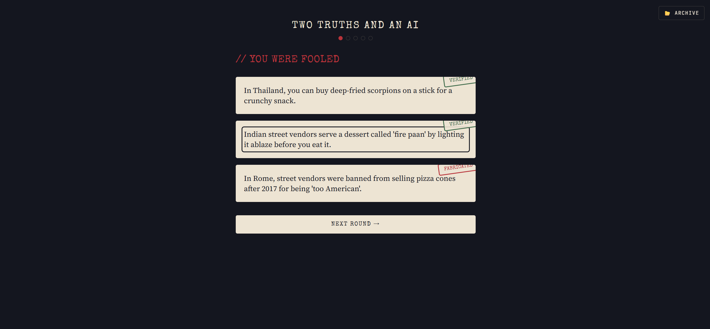
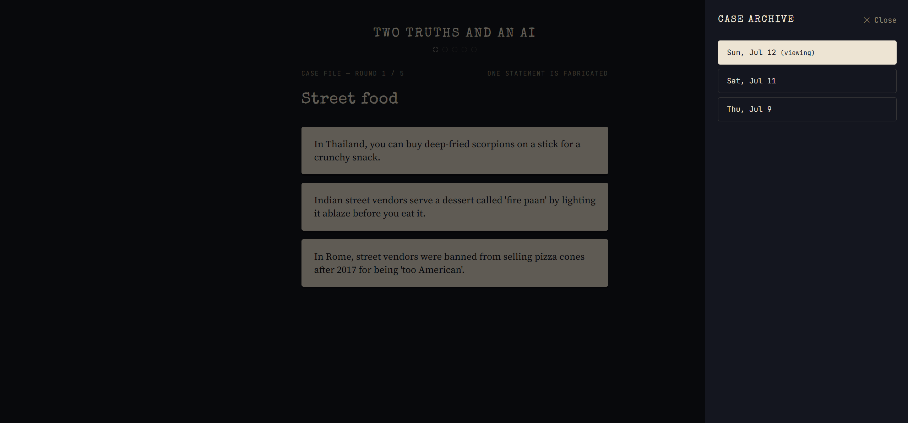
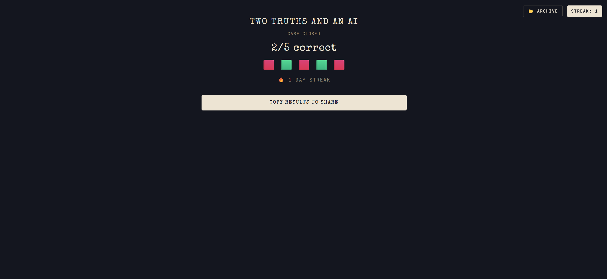

<div align="center">

# 🕵️ Two Truths and an AI

**A daily game of spot-the-lie - except the liar is an AI, and it's very convincing.**

[](https://twotruth.safeel.in)


</div>

---

## What is this

Every day, you get 5 rounds. Each round drops 3 statements about a topic - two are true, one was fabricated by AI to sound just as convincing. Your job: catch the lie before it catches you.

No sign-up. No app to download. Open the tab, play in under two minutes, come back tomorrow.

> *"Bananas are technically berries, but strawberries are not."*
> *"In 1518, dozens of people in Strasbourg danced nonstop for days until several dropped dead."*
> *"A man in Florida legally married a video game character in 2009 and it still isn't annulled."*
>
> One of those is a lie. Are you sure which one?

## Screenshots

<div align="center">


</div>
<div align="center">


</div>

## Why it's not just another Wordle clone

The mechanic is simple on purpose - spot-the-fake is easy to explain in one sentence. The actual engineering problem lives underneath it:

**Making an AI lie *well* is harder than making it tell the truth.** Ask Gemini for a false statement and by default you get something vague, hedged, or obviously synthetic ("some believe..."). Getting genuinely convincing hallucinations - confident, specific, textured with a fake year/name/number the way a *real* hallucination would be - took real iteration on prompting, tone-locking, and validation. That's the part of this project actually worth talking about in an interview: not "I built a trivia game," but "I figured out how to make an LLM lie convincingly on demand, on a budget of one free-tier API call a day."

## Features

- 🗞️ **Daily case file** - 5 fresh rounds a day, generated once by Gemini and cached, not regenerated per visitor
- 🔥 **Real streaks** - anonymous device ID in `localStorage`, no login, but your streak actually persists day to day
- 📂 **Case archive** - browse and replay any past day's puzzle in practice mode, without touching your streak
- 🖋️ **Interrogation-room aesthetic** - statements read like evidence cards; the reveal is a literal rubber-stamp verdict ("VERIFIED" / "FABRICATED")
- 📤 **Shareable results** - Wordle-style emoji grid + streak, one tap to copy
- 💸 **Genuinely $0 to run** - every piece of the stack sits on a free tier

## Tech stack

| Layer | Choice | Why |
|---|---|---|
| Frontend | React 19 + Vite + Tailwind v4 | Fast dev loop, no build config fuss |
| Backend | Vercel Serverless Functions | No separate server to host or pay for |
| Database | MongoDB Atlas (M0 free tier) | 512MB is overkill for this dataset |
| AI | Gemini 2.5 Flash | Free tier, fast, good at following tight style constraints |
| Scheduling | GitHub Actions (daily cron) | Free, reliable, unlimited on public repos |
| Hosting | Vercel + custom subdomain | `twotruth.safeel.in` |

## Architecture

```
├── api/                        # Vercel serverless functions - the entire backend
│   ├── generate-puzzle.js      # Cron-triggered: one Gemini call → 5 rounds → Mongo
│   ├── daily-puzzle.js         # GET today's (or ?date=YYYY-MM-DD) puzzle, answers stripped
│   ├── submit-guess.js         # POST a guess: scores it, updates streak (or not, in practice mode)
│   ├── puzzle-dates.js         # GET all dates that have a puzzle → powers the archive
│   ├── user-stats.js           # GET a device's current streak, for page-load display
│   └── leaderboard.js          # GET top streaks
│
├── src/
│   ├── components/
│   │   ├── RoundCard.jsx           # The 3-statement guessing screen
│   │   ├── ResultReveal.jsx        # Stamped verdict after each guess
│   │   ├── ShareCard.jsx           # End-of-day share grid
│   │   ├── StreakBadge.jsx         # Streak counter + archive trigger
│   │   ├── ArchiveCalendar.jsx     # Slide-out panel listing past cases
│   │   └── ProgressDots.jsx        # Round 1-5 progress indicator
│   ├── lib/
│   │   ├── device-id.js        # Anonymous localStorage device ID, no auth needed
│   │   └── api.js              # Typed fetch wrappers for every /api route
│   └── App.jsx                 # Game state machine + localStorage progress persistence
│
└── .github/workflows/
    └── daily-puzzle.yml        # Midnight cron → POSTs to /api/generate-puzzle
```

## How a puzzle actually gets made

1. **00:00 UTC**, a GitHub Actions workflow fires a single authenticated `curl` at `/api/generate-puzzle`.
2. The function checks Mongo - if today's puzzle already exists, it's a no-op (idempotent, safe to re-trigger by hand).
3. It picks 5 random topics from a curated pool of ~50 (skewed toward pop culture, internet trivia, true crime, and weird history - deliberately *not* textbook categories).
4. **One** Gemini call asks for all 5 rounds at once, under a heavily tone-locked prompt: 20-word statement cap, banned academic phrasing, explicit good/bad examples, instructions to fabricate using a concrete fake detail (a year, a name, a number) rather than invented science.
5. The response is validated locally - structure, word count, duplicate detection, a jargon-word blocklist - with zero additional API calls. If it fails validation, the whole generation retries.
6. Retries with backoff handle Gemini's free-tier `429`/`503` transient errors automatically.
7. Result gets written to MongoDB, keyed by date.

This went through a real iteration cycle worth mentioning: the first version made 10+ Gemini calls per puzzle (generate + verify, per topic) and blew through the daily free-tier quota in a single test session. Batching it into one call cut that to 1/day - a 90%+ reduction - while a local heuristic validator replaced the second API-based verification pass at zero marginal cost.

## Local development

```bash
git clone https://github.com/Charminglance/Two-Truths-and-an-AI.git
cd Two-Truths-and-an-AI
npm install
vercel env pull .env.local   # pulls MONGODB_URI, GEMINI_API_KEY, CRON_SECRET
vercel dev
```

Manually trigger puzzle generation locally:
```bash
curl -X POST http://localhost:3000/api/generate-puzzle -H "x-cron-secret: YOUR_CRON_SECRET"
```

### Environment variables

| Variable | Purpose |
|---|---|
| `MONGODB_URI` | MongoDB Atlas connection string |
| `GEMINI_API_KEY` | Gemini API key from Google AI Studio |
| `CRON_SECRET` | Shared secret so only the scheduled GitHub Action can trigger generation |

---

<div align="center">

Built by **[Safeel A](https://safeel.in)** · [GitHub](https://github.com/Charminglance) · [Instagram](https://instagram.com/safeel_z) · [LinkedIn](https://linkedin.com/in/itssafeel)

</div>
